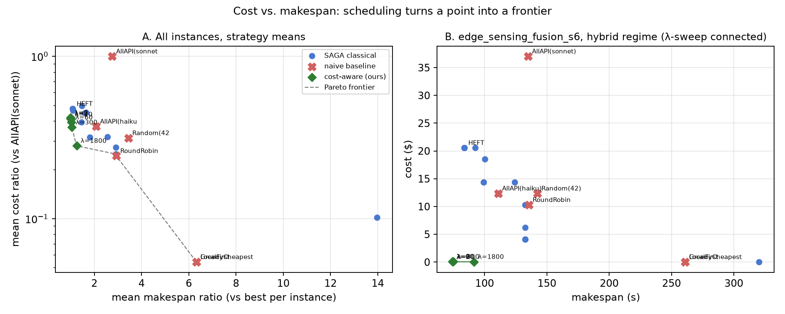

# OpenDAG-Agent

**Plan, schedule, execute, and audit multi-agent LLM workflows as task graphs across edge devices, local servers, cloud infrastructure, and hosted APIs.**

*SAGA plans. Wayline executes.*

[](https://github.com/ANRGUSC/opendag-agent/actions)
[](LICENSE)


OpenDAG-Agent is a research-oriented toolkit for modeling multi-agent LLM workflows as directed acyclic graphs, scheduling their tasks across heterogeneous execution environments, and evaluating cost/latency tradeoffs.

It connects agent workflow design with classical DAG scheduling. Instead of assuming every task runs on the same hosted frontier model, OpenDAG-Agent asks: **which task should run where, given model capability, network bandwidth, execution speed, and cost?**

The current release covers local modeling, scheduling, simulation, and deterministic execution, including a full simulation campaign. Cluster execution through [Wayline](https://github.com/ANRGUSC/wayline), profiling, and advanced audit/security features are planned roadmap items.

## What this project does

OpenDAG-Agent helps researchers and developers:

* Represent multi-agent LLM workflows as task graphs.
* Describe executors such as edge devices, nearby servers, cloud nodes, and hosted API models.
* Estimate compute, communication, and dollar-cost tradeoffs.
* Use [SAGA](https://github.com/ANRGUSC/saga) to schedule workflow tasks across heterogeneous executors.
* Compare classical DAG schedulers such as HEFT, CPoP, and MinMin against simple baselines.
* Run scheduled workflows locally with a deterministic mock LLM client for testing and simulation.

In short: OpenDAG-Agent studies **placement-aware execution for agent workflows**.

## Why this matters

Many multi-agent LLM systems are naturally graphs. A workflow may include model calls, tool calls, retrieval steps, aggregation steps, and final synthesis steps. Each step depends on outputs from earlier steps, so the workflow forms a directed acyclic graph, or DAG.

Most agent frameworks execute these graphs in dependency order. They usually leave model and executor assignment fixed by the developer. That works for many applications, but it does not answer a key systems question:

**Where should each step run?**

For example, a workflow might have access to:

* a small model on an edge device,
* a medium model on a nearby server,
* a larger model in the cloud,
* and one or more hosted API models with different prices and latencies.

These are **heterogeneous executors**: places where work can run, each with different speed, capability, cost, and network connectivity.

Classical DAG scheduling has studied this kind of placement problem for decades. OpenDAG-Agent applies those ideas to agentic LLM workflows. It models agent tasks and executor networks in terms that SAGA can schedule, then executes or simulates the resulting placement.

## Early result

The included simulation compares different ways to schedule the same workflow on the same network.


On a 3-site edge-sensing workflow:

* A framework-style baseline that sends every step to the frontier API takes **102 s** and costs **$18.53**.
* A placement-aware HEFT schedule takes **79 s** and costs **$10.29**.
* Cheap local-first strategies trace another part of the cost/latency tradeoff curve, reaching **$0.02** at **178 s**.

The main takeaway is that placement matters. A scheduler that accounts for executor speed, network bandwidth, model capability, and cost can find schedules that are both faster and cheaper than naive hosted-API execution.

An interesting detail: with 2 Mbps site uplinks, HEFT may decide that shipping raw data to parallel API nodes is faster than extracting locally. When uplinks are tightened, the preferred placement shifts back toward the edge. This kind of network-aware reasoning is exactly what many agent frameworks do not yet provide.

## Simulation campaign results (P1)

The full P1 simulation campaign is complete: 1,767 validated schedules across 5 topology families, graph sizes from 10 to 100 tasks, and 3 network regimes (edge-heavy, hybrid, and API-rich), comparing 19 classical SAGA schedulers, 6 naive baselines, and a cost-aware λ-sweep. Regenerate everything with `python experiments/run_p1.py`.



Key findings:

* The framework-style baseline that sends every step to the frontier API averages **1.4–3.7× the best achievable makespan**, depending on topology family, and is strictly dominated on the cost/makespan plane.
* The cost-aware λ-sweep is a knob agent frameworks do not have: on the flagship edge-sensing instance it beats HEFT's makespan at near-zero dollar cost by keeping work local. Data locality pays on both axes.
* Honest negatives, reported: not every classical algorithm transfers (GDL lands around 12×, echoing SAGA's PISA finding that no scheduler dominates), and repair-wrapped constraint-blind schedulers lose to natively constraint-aware greedy schedulers on pinned graphs. This motivates the constraint-aware classical variants on the roadmap.
* Under LLM latency variance, stochastic SHEFT improves p95 makespan by up to 3.2% over MeanHEFT at zero extra cost (paired Monte-Carlo, experiment E1b).
* Independent-engine validation: SAGA's analytic makespans and ncsim's discrete-event simulations agree within 0.0–0.8% on identical instances.

Distributions across all 57 instances: [f4_makespan_distributions.png](docs/img/f4_makespan_distributions.png). A scheduler ranking table is written to `figures/out/t2_ranking.md` after a run.

## Quickstart

This quickstart runs locally. It requires no cluster, no API keys, and no paid API calls.

Prerequisite: **Python 3.12+**

```bash
git clone https://github.com/ANRGUSC/opendag-agent
cd opendag-agent
python -m venv .venv && . .venv/bin/activate   # Windows: .venv\Scripts\activate
pip install -e ".[dev]"
pytest                                          # 21 tests, a few seconds
python experiments/e1_sim.py --quick            # schedules 3 workflows 9 ways
```

The quick simulation:

* schedules three workflow topologies using nine strategies,
* compares SAGA schedulers with simple baselines,
* writes results to `figures/out/e1_results.csv`,
* renders the Gantt comparison shown above,
* and mock-executes one HEFT schedule with the `LocalRunner`.

The mock execution uses a deterministic `MockLLMClient`, so it is free and repeatable.

## How it fits together

```text
AgentGraph ──▶ profiles ──▶ SAGA schedule ──▶ execute ──▶ signed audit log
 (graphs/)     (profile/)    (schedule/)      (execute/)   (security/)
```

OpenDAG-Agent starts with an `AgentGraph`, which describes the workflow as typed tasks and dependencies. Executor and network profiles describe where tasks can run and how expensive or slow each option is. The scheduler converts this information into SAGA's graph and network abstractions, chooses placements, and then hands the schedule to an execution layer. Future security features will add signed records and audit logs for executed workflows.

## Current status

The current release implements the core local research workflow and the full simulation campaign.

Implemented now:

* agentic DAG model and JSON format,
* canonical parameterized workflow topologies,
* SAGA bridge for scheduling,
* feasibility constraints for model tiers and pinned tasks,
* baseline scheduling strategies,
* dollar-cost model,
* cost-aware λ-sweep scheduler,
* stochastic instances with Monte-Carlo schedule evaluation,
* deterministic local runner,
* quick simulation experiment,
* full P1 simulation campaign with Pareto fronts and scheduler rankings.

Planned or in progress:

* measured profiling for local models, hosted APIs, and bandwidth,
* Wayline ODAG compiler,
* live execution on a k3s edge cluster,
* full signed-envelope and audit-chain security layer,
* privacy-preserving partitioned execution demos,
* DAGBench integration.

## Modules

| Module             | What it does                                                                                                                                                                                       | Status     |
| ------------------ | --------------------------------------------------------------------------------------------------------------------------------------------------------------------------------------------------- | ---------- |
| `opendag.graphs`   | Defines the agent workflow DAG model, typed tasks, model tiers, pins, payloads, JSON format, and canonical topologies.                                                                             | P0         |
| `opendag.schedule` | Converts executor/network models and agent graphs into SAGA inputs. Adds baseline schedulers, feasibility enforcement, cost modeling, a cost-aware λ-sweep scheduler, and Monte-Carlo evaluation. | P0–P1      |
| `opendag.execute`  | Provides `LocalRunner`, an async in-process execution engine with pluggable LLM clients. Includes a free deterministic `MockLLMClient`.                                                            | P0         |
| `opendag.profile`  | Stores measured token throughput, API latency, and bandwidth profiles in dagprofiler-style JSON.                                                                                                   | Planned P2 |
| `opendag.security` | Provides groundwork for identities, signed envelopes, hash-chained audit logs, and `opendag verify`.                                                                                               | Planned P3 |

Status labels refer to roadmap phases:

* **P0–P1**: implemented in the current release.
* **P2–P4**: planned future milestones.

## Core concepts

### Agent graphs

An `AgentGraph` represents an agent workflow as a DAG. Nodes are tasks such as model calls, tool calls, or aggregation steps. Edges represent data or context passed between tasks.

### Executors

An executor is a place where a task can run. Examples include an edge device, a local server, a cloud node, or a hosted API model.

Each executor can have different:

* model capability,
* token throughput,
* latency,
* dollar cost,
* and network bandwidth to other executors.

### Model tiers

Model tiers keep comparisons fair.

Each task declares the minimum model capability it needs. Each executor declares the model tier it can provide. A scheduler is only allowed to place a task on an executor that satisfies the task's required tier.

The current tiers are:

| Tier       | Meaning                                                      |
| ---------- | ------------------------------------------------------------ |
| `ANY`      | Any available model is acceptable.                           |
| `SMALL`    | Roughly small local models, around 3B parameters.            |
| `MEDIUM`   | Roughly medium local or server models, around 8B parameters. |
| `FRONTIER` | Hosted frontier-scale API models.                            |

This prevents unfair comparisons. For example, a scheduler cannot make a frontier-required task look cheap by silently assigning it to a 1B edge model.

`ConstrainedScheduler` wraps stock SAGA schedulers so they respect model-tier and pinning constraints.

### Units

OpenDAG-Agent uses simple units so compute and communication both reduce to time in seconds.

| Quantity                                 | Unit                   |
| ---------------------------------------- | ---------------------- |
| Task compute weight                      | Expected output tokens |
| Executor speed                           | Tokens per second      |
| Edge payload                             | KB                     |
| Bandwidth                                | KB/s                   |
| Scheduled compute and communication time | Seconds                |

Current modeling simplifications:

* prefill time is folded into executor speed,
* context-window limits are not enforced,
* oversized placements show up only as expensive placements,
* local executors have zero dollar cost,
* executor parameters are declared rather than measured.

These simplifications are intended to be replaced by the planned P2 profiler.

## The ANRG open-source family this builds on

| Artifact                                              | Role here                                                                                                   |
| ----------------------------------------------------- | ----------------------------------------------------------------------------------------------------------- |
| [SAGA](https://github.com/ANRGUSC/saga)               | Scheduling engine with 23 classical algorithms and one `Scheduler` API. Installed from PyPI as `anrg-saga`. |
| [Wayline](https://github.com/ANRGUSC/wayline)         | k3s-native ODAG runtime and future execution target for OpenDAG-Agent.                                      |
| [dagprofiler](https://github.com/ANRGUSC/dagprofiler) | DAG Task Standard and profile format that the planned profiler extends.                                      |
| [DAGBench](https://github.com/ANRGUSC/dagbench)       | Planned benchmark home for the agentic topology suite.                                                      |
| [ncsim](https://github.com/ANRGUSC/ncsim)             | Discrete-event simulator used as a cross-check for simulation campaigns.                                    |
| [Jupiter](https://github.com/ANRGUSC/Jupiter)         | Earlier ANRG work on dispersed computing with profiler, mapper, and dispatcher components.                  |

## Roadmap

### P0: Core release (done)

* Agentic DAG model and canonical topologies.
* SAGA bridge.
* Feasibility constraints.
* Baseline strategies.
* Cost model.
* LocalRunner.
* Quick simulation.

### P1: Full simulation campaign (done)

* Swept 5 topology families, graph sizes from 10 to 100 tasks, and 3 network regimes.
* Compared 19 classical SAGA schedulers, 6 naive baselines, and a cost-aware λ-sweep.
* Generated cost/makespan Pareto fronts and scheduler ranking tables.
* Evaluated stochastic SHEFT against MeanHEFT under LLM latency variance with paired Monte-Carlo runs.
* Cross-checked results against the ncsim discrete-event simulator.
* Regenerate all artifacts with `python experiments/run_p1.py` (outputs in `figures/out/`).

### P2: Profiling and Wayline execution

* Add profiler support for Ollama, Anthropic, and bandwidth measurements.
* Compile OpenDAG-Agent graphs to Wayline ODAGs.
* Run live Scenario A: edge intelligence report on a lab k3s cluster.

### P3: Live campaigns and security

* Run full live campaigns.
* Add signed envelopes, audit chains, capability manifests, and `opendag verify`.
* Demonstrate privacy-preserving partitioned execution, where data or model pieces move between nodes only at computation time so no single node holds the whole.

### P4: Reproduction and release

* Add optional DigitalOcean reproduction scripts.
* Submit the agentic topology suite to DAGBench.
* Release v0.1.0.

## Terminology

| Term            | Meaning                                                                                                      |
| --------------- | ------------------------------------------------------------------------------------------------------------ |
| DAG             | Directed acyclic graph: a graph of tasks and dependencies with no cycles.                                    |
| AgentGraph      | OpenDAG-Agent's representation of an agent workflow as a DAG.                                                |
| Executor        | A place where a task can run, such as an edge device, server, cloud node, or API model.                      |
| Placement       | The assignment of a task to an executor.                                                                     |
| Schedule        | A full plan for where and when tasks should run.                                                             |
| Makespan        | Total time from the start of the workflow to its completion.                                                 |
| Model tier      | A coarse capability class such as `SMALL`, `MEDIUM`, or `FRONTIER`.                                          |
| Pareto frontier | A set of tradeoff points where improving one objective, such as cost, would worsen another, such as latency. |
| LocalRunner     | The local execution engine used for deterministic in-process runs.                                           |
| SAGA            | ANRG's scheduling library with classical DAG scheduling algorithms behind a common API.                      |
| Wayline         | ANRG's k3s-native ODAG runtime and planned live execution backend for OpenDAG-Agent.                         |

## References

* J. Coleman, B. Krishnamachari, "PISA: An Adversarial Approach To Comparing
  Task Graph Scheduling Algorithms," [arXiv:2403.07120](https://arxiv.org/abs/2403.07120)
* J. Coleman, R. V. Agrawal, E. Hirani, B. Krishnamachari, "Parameterized
  Task Graph Scheduling Algorithm for Comparing Algorithmic Components,"
  [arXiv:2403.07112](https://arxiv.org/abs/2403.07112)
* P. Ghosh et al., "Jupiter: A Networked Computing Architecture,"
  [arXiv:1912.10643](https://arxiv.org/abs/1912.10643)
* B. Krishnamachari, M. Gutierrez, J. Coleman, "ncsim: A Lightweight
  Simulator for Networked Edge Computing with Wireless Interference
  Modeling," [arXiv:2605.01094](https://arxiv.org/abs/2605.01094)

## License

MIT. Note that the `anrg-saga` dependency currently carries its own non-commercial research license. This repository contains no SAGA code and depends on it only via PyPI.

---

*Autonomous Networks Research Group, University of Southern California.*
