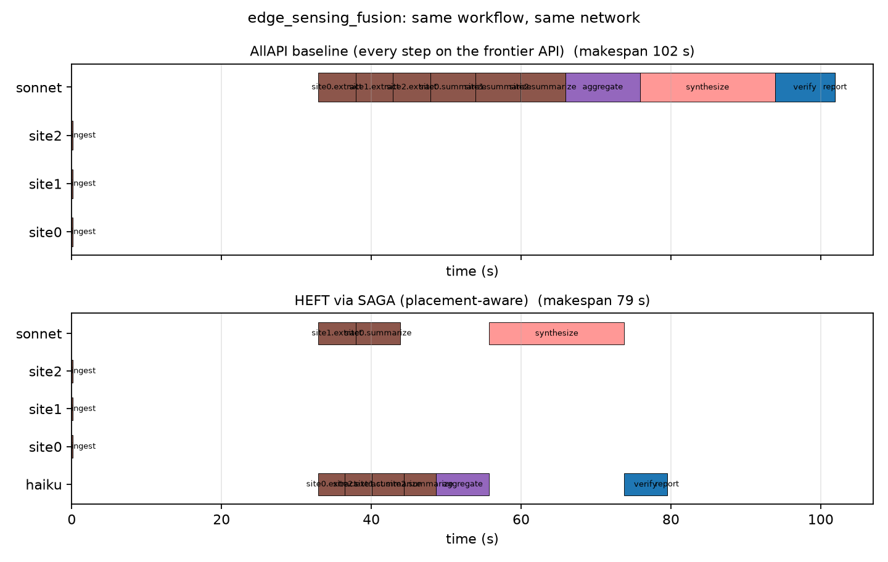

# OpenDAG-Agent

**Plan, schedule, execute, and audit multi-LLM-agent workflows as task graphs
across heterogeneous edge, cloud, and hosted-API executors.**
*SAGA plans, Wayline executes.*

[](https://github.com/ANRGUSC/opendag-agent/actions)
[](LICENSE)


## Why

Multi-agent LLM systems are task graphs: nodes are model calls, tool calls,
and aggregation steps; edges carry context between them. Today's agent
frameworks (LangGraph, CrewAI, AutoGen, and friends) execute those graphs
topologically with model assignments fixed by the developer — no framework
reasons about *where* each step should run when the available executors are a
1B model on an edge device, an 8B model on a nearby server, and two hosted
API tiers with very different prices and speeds.

Classical DAG scheduling solved this placement problem decades ago.
[SAGA](https://github.com/ANRGUSC/saga) packages 23 of those algorithms
(HEFT, CPoP, MinMin, ...) behind one interface. OpenDAG-Agent is the bridge:
it models agent workflows and heterogeneous executor networks in SAGA's
terms, schedules them with any SAGA scheduler, and executes the result —
locally for development, and through
[Wayline](https://github.com/ANRGUSC/wayline) on a k3s edge cluster for real
runs (in progress, see roadmap).

One early result from the included simulation (same workflow, same network):



On a 3-site edge-sensing workflow, the framework-default baseline (every step
on the frontier API) takes **102 s and $18.53**; HEFT's placement-aware
schedule takes **79 s and $10.29** — faster *and* cheaper — and cheap
local-first strategies trace out the rest of a cost/latency Pareto frontier
($0.02 at 178 s). Interestingly, HEFT discovers that with 2 Mbps site
uplinks, shipping raw data to parallel API nodes beats extracting locally on
makespan; tightening the uplinks flips the optimum back to the edge. That
placement reasoning is exactly what agent frameworks are missing.

## Quickstart (no cluster, no API keys, no cost)

```bash
git clone https://github.com/ANRGUSC/opendag-agent
cd opendag-agent
python -m venv .venv && . .venv/bin/activate   # Windows: .venv\Scripts\activate
pip install -e ".[dev]"
pytest                                          # 21 tests, a few seconds
python experiments/e1_sim.py --quick            # schedules 3 workflows 9 ways
```

`e1_sim.py` prints a makespan/cost table for three agentic workflow
topologies under nine strategies (HEFT, CPoP, MinMin via SAGA, plus the
naive baselines agent frameworks effectively use), writes
`figures/out/e1_results.csv`, renders the Gantt comparison above, and
mock-executes one HEFT schedule with the LocalRunner to check predicted
against simulated makespan (typically within a few percent).

## How it fits together

```
AgentGraph ──▶ profiles ──▶ SAGA schedule ──▶ execute ──▶ signed audit log
 (graphs/)     (profile/)    (schedule/)      (execute/)   (security/)
```

| Module | What it does | Status |
|---|---|---|
| `opendag.graphs` | Agentic DAG model (typed tasks, model tiers, pins, payloads), JSON format, five canonical parameterized topologies | ✅ P0 |
| `opendag.schedule` | Executor/network model → SAGA `Network`; AgentGraph → SAGA `TaskGraph`; baseline strategies as SAGA `Scheduler` subclasses; feasibility (tier/pin) enforcement wrapper; $ cost model | ✅ P0 |
| `opendag.execute` | `LocalRunner`: async in-process execution with a pluggable LLM client (`MockLLMClient` is free and deterministic) | ✅ P0 (Wayline ODAG compiler: P2) |
| `opendag.profile` | Measured token throughput / API latency / bandwidth profiles (dagprofiler-style JSON) | ⬜ P2 |
| `opendag.security` | Ed25519 identities, signed envelopes, hash-chained audit log, `opendag verify` | ⬜ P3 |

### Model tiers keep comparisons honest

Every task declares a `min_tier` (ANY / SMALL≈3B / MEDIUM≈8B / FRONTIER) and
every executor a capability tier. All strategies — classical and naive —
choose only among tier-feasible, pin-respecting placements, so schedulers
compete on placement quality, not on quietly routing frontier work to a 1B
model. `ConstrainedScheduler` makes any stock SAGA scheduler
feasibility-safe.

### Units

Task compute weight = expected output tokens; executor speed = tokens/sec;
edge payload = KB; bandwidth = KB/s. Both compute and communication divide
out to seconds, which is what SAGA schedules.

**P0 modeling simplifications** (all replaced by the P2 profiler): prefill
time is folded into executor speed; context-window limits are not enforced
(oversized placements just show up as expensive); local executors cost $0;
executor parameters are declared, not measured.

## The ANRG open-source family this builds on

| Artifact | Role here |
|---|---|
| [SAGA](https://github.com/ANRGUSC/saga) | The scheduling engine (23 classical algorithms, one `Scheduler` API) — installed from PyPI as `anrg-saga` |
| [Wayline](https://github.com/ANRGUSC/wayline) | k3s-native ODAG runtime with a data-availability-aware scheduler — the P2 execution target |
| [dagprofiler](https://github.com/ANRGUSC/dagprofiler) | DAG Task Standard and profile format the P2 profiler extends |
| [DAGBench](https://github.com/ANRGUSC/dagbench) | Benchmark home for the agentic topology suite (planned contribution) |
| [ncsim](https://github.com/ANRGUSC/ncsim) | Discrete-event cross-check for the simulation campaign |
| [Jupiter](https://github.com/ANRGUSC/Jupiter) | DARPA-era dispersed-computing lineage (profiler → mapper → dispatcher) |

## Roadmap

- **P0 (this release):** agentic DAG model + topologies, SAGA bridge,
  feasibility constraints, baselines, cost model, LocalRunner, quick sim.
- **P1:** full simulation campaign — topology × size × network-regime sweep
  across all SAGA schedulers (incl. stochastic SHEFT), cost/makespan Pareto
  fronts, scheduler ranking tables.
- **P2:** profiler (ollama + Anthropic + bandwidth), Wayline ODAG compiler,
  live Scenario A (edge intelligence report) on a lab k3s cluster.
- **P3:** full live campaigns, security layer (signed envelopes, audit
  chain, capability manifests, `opendag verify`).
- **P4:** optional DigitalOcean reproduction scripts, DAGBench PR, v0.1.0.

## References

- J. Coleman, B. Krishnamachari, "PISA: An Adversarial Approach To Comparing
  Task Graph Scheduling Algorithms," [arXiv:2403.07120](https://arxiv.org/abs/2403.07120)
- J. Coleman, R. V. Agrawal, E. Hirani, B. Krishnamachari, "Parameterized
  Task Graph Scheduling Algorithm for Comparing Algorithmic Components,"
  [arXiv:2403.07112](https://arxiv.org/abs/2403.07112)
- P. Ghosh et al., "Jupiter: A Networked Computing Architecture,"
  [arXiv:1912.10643](https://arxiv.org/abs/1912.10643)
- B. Krishnamachari, M. Gutierrez, J. Coleman, "ncsim: A Lightweight
  Simulator for Networked Edge Computing with Wireless Interference
  Modeling," [arXiv:2605.01094](https://arxiv.org/abs/2605.01094)

## License

MIT. Note that the `anrg-saga` dependency currently carries its own
non-commercial research license; this repository contains no SAGA code and
depends on it only via PyPI.

---
*Autonomous Networks Research Group, University of Southern California.*
